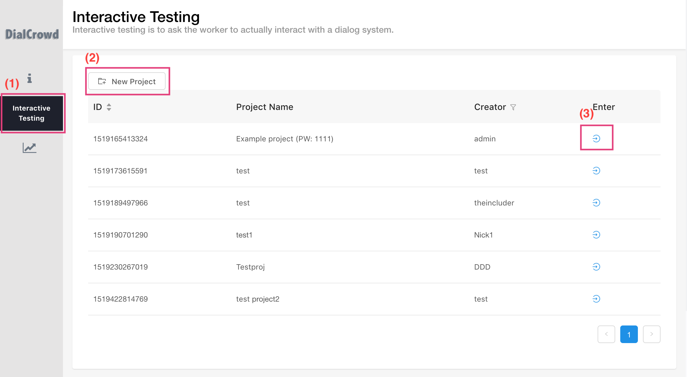

### 1) Create a project

**Figure 1**

Figure 1 shows an overall process of creating a project using DialCrowd:
- First, select a type of evaluation: interactive testing or non-interactive testing.
- Second, click the "New Project" button and input the name of a project. 
- Third, if you successfully create the "New project", you will see your project in the table. Please click the enter icon to start. 
We provide several examples that you can follow.

### 2) Project setting 

**Figure 2**

After creating a project, you need to design the experiment in detail, including a generic introduction, specific instructions, and exit polls. DialCrowd provides the dialog evaluation for a single dialog system and gets feedback ratings (1 to 5). It is also possible to evaluate more than one dialog system and compare them like A/B testing. You can simply add more dialog systems in the DialCrowd Admin panel. It will present the dialog systems in randomized order. For non-interactive testing, JSON data, such as dialog logs, needs to be added. DialCrowd also supports the simple add-on of various types of exit polls like Likert scale, open-ended, and A/B testing and also presents them in randomized order to workers.

### 3) Connect your spoken dialog systems
To connect to DialCrowd, an dialog system needs to have an HTTP server waiting for utterances directed from DialCrowd through specific protocols. We are making connecting to DialCrowd extremely easy for anyone with basic programming knowledge by providing them with off-the-shelf server wrapper templates in three mainstream programming languages: Java, Python, and JavasSript. This HTTP API communication protocol is the same as the DialPort. Thus, if your dialogs systems already used for evaluation in DialCrowd, it would be also ready to collect to Dialport. [Code in Github](https://github.com/DialRC/PortalAPI)

Following the DialCrowd communication protocols, the Java, Python, and JavaScript server wrappers are implemented with the Spark, Flask, and Node.js frameworks respectively. In this way, we completely hide the implementation of RESTful APIs from the researchers. As a result, researchers only need to modify two methods in the wrapper to connect to DialCrowd, making the whole connecting process pain-free. 
To collect dialog systems to DialCrowd, an researcher has to implement an HTTP API server that supports three RESTful APIs /init, /next, /end. You can simply download the example code. Based on the example code, you can easily make this RESTful APIs. Very simple!

#### 1. Create a new session ###

Start a new session with your dialog system. If successful, the server will return an JSON containing the session ID.

**URL**

    /init

**Method:**

   `POST`
  
**Body Data**

    { "sessionID": "USR_1234",
      "timeStamp": "yyyy-MM-dd'T'HH-mm-ss.SSS"
    }
     
**Success Response (200):** 
	
	{
	  "sessionID": "USR_1234",
	  "sys": "This word starts with A",
	  "version": "1.0-xxx",
	  "timeStamp": "yyyy-MM-dd'T'HH-mm-ss.SSS",
	  "terminal": false
	}

#### 2. Get your system's next response

For an ongoing session, the portal will use this API to obtain the next system response from your dialog system.

**URL**

    /next

**Method:**

   `POST`
  
**Body Data**

	{
	    "sessionID": "USR_1234",
	    "text": "I guess the answer is APPLE", 
	    "asrConf": 0.9,
	    "timeStamp": "yyyy-MM-dd'T'HH-mm-ss.SSS"
	}
	     
**Success Response (200):** 
	
	{
	  "sessionID": "USR_1234",
	  "sys": "This word starts with A",
	  "version": "1.0-xxx",
	  "timeStamp": "yyyy-MM-dd'T'HH-mm-ss.SSS",
	  "terminal": false
	}

#### 3. Terminate a session with your system ###

The portal sometimes (very rarely) wants to terminate an ongoing session with your dialog system (e.g. due to a lost connection, conversation failure etc.)

**URL**

    /end

**Method:**

   `POST`
  
**Body Data**

	{
	    "sessionID": "USR_1234",
	    "timeStamp": "yyyy-MM-dd'T'HH-mm-ss.SSS"
	}
	     
**Success Response (200):** 
	
	{
	  "sessionID": "USR_1234",
	  "sys": "Goodbye",
	  "version": "1.0-xxx",
	  "timeStamp": "yyyy-MM-dd'T'HH-mm-ss.SSS",
	  "terminal": true
	}

### 4) Testing and Deploying

**Figure 3**

After running the backend RESTful APIs, please input the backend API URL and check the connection in DialCrowd. If you have successfully connected to your dialog systems to DialCrowd you can preview the website that DialCrowd has automatically generated.
