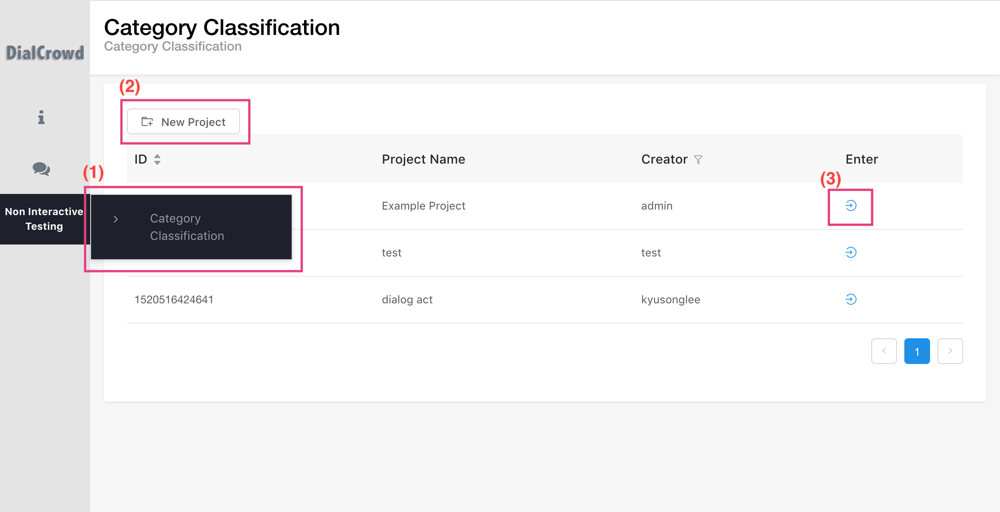
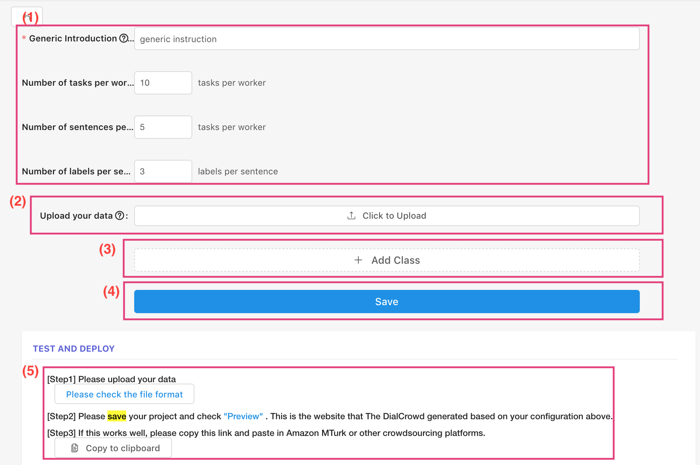

We have categorized non-interactive tests into four subcategories: category classification, sequence labeling, A/B tests, and Likert scale. We Currently only support "category classification".
- **Category classification:** a requester provides a set of labels. The worker selects one of the labels on the given dialog or sentences. 1) select one of these categories for each dialog (e.g., too short, multi task, task complete out of scope, or task incomplete) 2) asked a binary question: Is any part of the response to this quote sarcastic? 3)  ask workers to decide whether, given the first one or two utterances of context, the shown continuation is the actual follow-up utterance in the original dialogue or a random response.
-  **Sequence labeling:** the worker selects a specific word or phrase in a sentence or paragraph and then answers a predefined multiple choice question:  1) named entity tagging on the given text 2) a task of mapping each mention in context to one or more characters in a knowledge base.
- **A/B tests:** The worker selects the candidate amongst several that are proposed. (e.g., “given the context and the system output for the baseline and the context-aware system, and they were asked to pick the variant that sounds more natural”, “select the best response among $n$ candidate responses”) 
- **Likert scale:**  a worker assigns a rating to a given dialog or sentence. (e.g., give a score from 1 to 5 on how good the response is given the context. score each utterance in terms of informativeness and naturalness) 

# Category Classification

**Figure 1**
Figure 1 shows an overall process of creating a project using DialCrowd:

- First, select a type of evaluation: non-interactive testing.
- Second, click the "New Project" button and input the name of a project.
- Third, if you successfully create the "New project", you will see your project in the table. Please click the enter (edit) icon to start. We provide several examples that you can follow.


**Figure 2**

## (1) Basic information 
In order to setup the category classification, requesters fill out the following information:
```
ex)
- Generic Introduction: Please select one of dialog acts.....
- Number of task per HIT: 10
- Number of sentence per task: 5 
- Number of worker per sentence: 3
```
The above example indicates that 5 sentences will be shown to workers per page. They have to finish 10 pages. Thus, a worker has to annotate total 50 sentences (Number of task per worker(10) * Number of sentences per page(5)= 50). (Number of worker per sentence: 3) mean one sentence will be annotated by 3 workers. 


## (2) Upload your data
Format of Category Classification
The foramt of category classification is just sentences splited by newline (\n)
```
Has onihime vs been made into an anime
What percent of 25 is 23
What does C K mean
How do you say eggs with bacon and toast in spanish
Is cat litter safe for concrete to melt ice
U-235 and Pu-239 are both what
Did Hannibal Lecter kill Allegra Pazzi
```

## (3) Add Class
You need to define class categories (e.g., inform, request, confirm, etc) and example sentences for workers.  
These exmaples will be shown in DialCrowd Workers. 

## (4) Save your project
## (5) Test and deploy
You can download the format for uploading your data. You can preview the DialCrowd Worker's website. 


