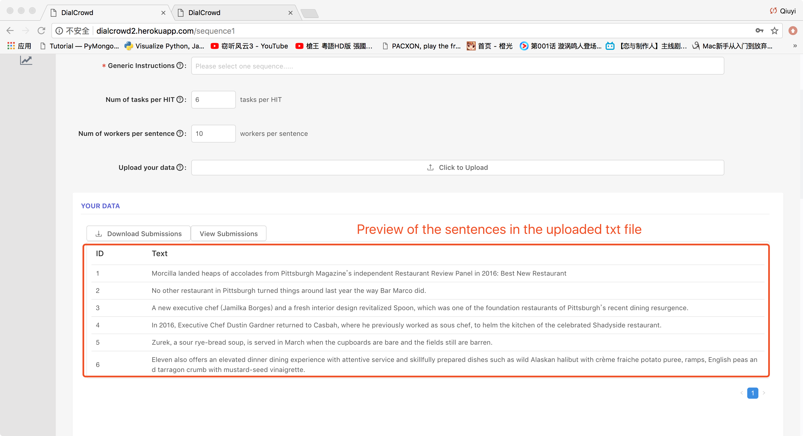

-  **Goals and Expectations:** The goal of this crowdsourcing feature is to categorize different types of entities. After entering the website of sequence labeling, the worker will be asked to select specific words or a phrase in a sentence and choose the corresponding type of entity that phrase can be categorized into to using the buttons below the sentence. If the worker is not sure which type of entity it belongs to, choose "other".

# Sequence Labeling

**Figure 1**

**Figure 2**

Figure 1 and figure 2 show an overall process of creating a project of sequence labeling using DialCrowd:

- First, select a type of evaluation: non-interactive testing.
- Second, choose "Sequence Labeling"
- Third, click the "New Project" button and name the new project. Please also input your name and set the password.
- Finally, if the requester successfully creates the "New project", the requester will see his new project in the table. Please click the enter (edit) icon to start. We will provide a guide that you can follow.

## (1) Basic information 
In order to setup a new sequence labeling project, the requester needs to fill out the following information:

**Figure 3**

- After creating a new project, the requesters set the settings and configurations of his project.
- First, the requester puts down the background information and genereic instructions.
- Then, the requester sets the amount of work for the worker. (The above example indicates that 6 sentences will be shown to each worker. Each uploaded sentence will be worked by 10 workers.)

## (2) Upload your data
The data can be uploaded by uploading a .txt file that contains the sentences for the workers to analyze using sequence labeling. Separate the sentences with line change in the txt file. The place where the requester uploads the file is marked in figure 3.

**Figure 4**

Figure 4 shows the sentences that the requester uploads.

## (3) Add Type of Entities

**Figure 5**

Figure 5 shows how a requester can edit the types of entities that will appear in the sequence labeling page.

## (4) Save your Project

Click the blue "save" button

## (5) Test and Deploy

**Figure 6**

Figure 6 shows how the requester can enter the worker's sequence labeling page to test and re-check the settings. (Copy and paste the url in the browser and the worker's sequence labeling page will show up.)

## (6) Sequence Labeling Page for Workers
The below images display how the workers use sequence labeling to tag name entities with text selection.

After finishing the sequence labeling, workers will receive a code for the payment.
